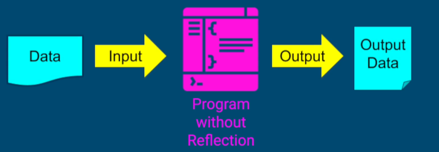
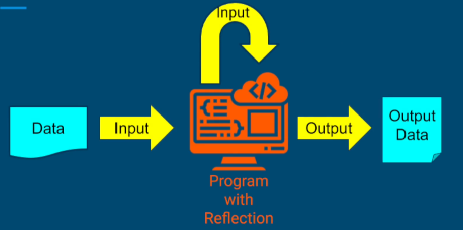
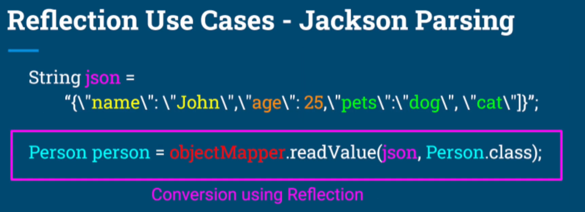
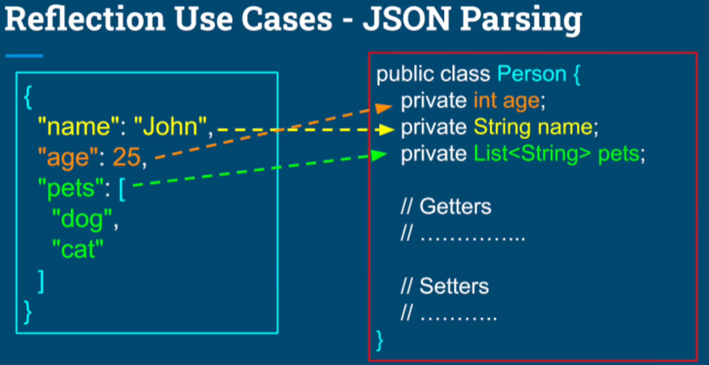
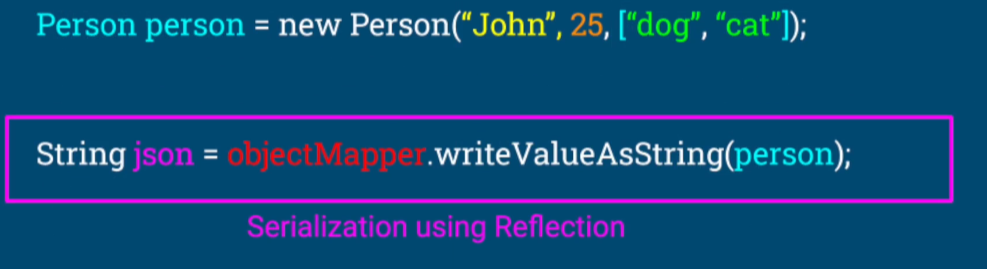

# Java Reflection ??
- JVM에 내장된 기능
- 실행하는 동안 클래스와 객체 정보 추출하는 기능
- Reflection API (JDK에 포함됨) 로 이 기능 사용 가능
- 프로그램 런타임에 소스코드 수정 없이 프로그램 순서 제어 가능
- 다목적 알고리즘 작성 가능
  (ex : 런타임 중인 객체에 따라 알고리즘 조정 가능)


- 보통 어플리케이션이 실행되고 어떠한 데이터가 input값으로 들어와서   
  비즈니스 로직을 처리하고 결과 데이터를 생성하는 것이    
  "리플렉션"이 적용되지 않은 아래와 같은 일반적인 어플리케이션의 모습이라면





   


- 리플렉션을 적용하여 어플리케이션을 생성하면 <br>
  외부 입력값과 어플리케이션 코드 모두를 input값으로 간주하고 이를 분석하고 <br>
  로직을 수행하여 아래와 같이 결과 데이터를 생성한다.





- 어플리케이션을 실행하면서 객체&클래스를 분석하고 이를 활용하여 <br>
  현재 많은 사람들이 사용하는 라이브러리, 프레임워크, APP 등 설계가 가능.


# 그래서 리플렉션을 사용한 상용 어플리케이션엔 어떤게 있고 뭘할 수 있는데 ??
### 1) JUnit : 리플렉션으로 만들어진 Java App Unit test 표준 프레임워크. <br><br>

##### Case 1) JUnit이 없으면?
```Java
public class CarTest { 
    public void setUp() {...}
    public void testDrive() {...}
    public void testBrake() {...}

    // 이렇게 클래스를 main 메소드에서 수동으로 인스턴스를 생성해야 함.
    // test 메소드 각각을 수동 설정하고 호출해야하는 번거로움이 있음.
    public static void main() {
        CarTest carTest = new CarTest();
        carTest.setUp();
        carTest.testDrive();
        carTest.setUp();
        carTest.testBrake();
    }
}
```

<br>

##### Case 2) JUnit을 사용하면?
```Java
public class CarTest {

    // 아래와 같이 어노테이션을 추가함으로써 수동으로 인스턴스를 생성하는 과정을 생략할 수 있음.
    // JUnit이 내부적으로 어노테이션이 활성화된 클래스를 인스턴스화 함.
    @Before
    public void setUp() {...}
  
    @Test
    public void testDrive() {...}
  
    @Test
    public void testBrake() {...}
}
```

- 즉, Reflection을 사용하면 어노테이션이 붙은 메소드들을 전부 추적하여 <br>
  인스턴스화가 필요하면 인스턴스화하고 순서대로 실행한 후, 결과 Output을 반환한다. <br><br><br>


### 2) Dependency Injection (의존성 주입) 

- ex : Spring / Spring Boot, Google Guice 등 <br><br>

아래 코드에서 Engine과 Driver 객체가 Car 클래스에 필요하다고 가정했을 경우, <br>
의존성 주입이 없으면 수동으로 Car 객체를 만들어서 의존 관계를 만들어야 한다.
```Java
public class Car {

  public Car() {
      this.engine = new Engine();
      this.driver = createDriver();
  }
  
  ...
  ...
  public void drive() {...}
}
```

<br>
그러나 리플렉션이 적용된 @Autowired 어노테이션을 사용하면 <br>
아래와 같이 어노테이션 추가하는 것만으로 객체 생성에 대한 코드 간소화가 가능해진다. <br>
이런게 가능한 이유는 Spring / Spring boot에 Reflection 기술이 적용되어 있기 때문

```Java
public class Car {
  ...
  @Autowired            // 객체 생성 어노테이션 추가
  public Car(Engine engine, Driver driver) {
      this.engine = engine;
      this.driver = driver;
  }
  ...
  
  public void drive() {..}
}
```

<br>
또 다른 예로는 @configuration이 있다. <br>
구체적인 의존관계를 생성하는 메소드에는 @Bean 어노테이션을 추가하여 <br>
의존관계를 형성한다.

```Java
@Configuration
public class Config {
    @Bean
    public Engine createEngine() {
      ...
    }
    
    @Bean
    public Driver createDrive() {
      ...
    }
  
}
```

<br>
위 코드들을 정리하면, 어플리케이션을 실행하면 Spring / Spring boot 프레임워크는 <br>
Car 클래스를 찾고 @Bean으로 등록한 Engine과 Driver를 찾고 객체로 만든다. <br>
그리고 Car 클래스 생성자에 Engine과 Driver 객체를 주입하고 Car 객체를 하나 생성한다. <br><br>

이러한 작업이 가능한 이유는 스프링 내에서 Reflection을 사용함으로써 가능해진다. <br><br><br>


### 3) JSON Serialization / Deserialization
- ex : Jackson, Gson 라이브러리 <br><br>

#### - 일반적인 Jackson 라이브러리 사용 코드 예시 (직렬화)


<br>

#### - 동작원리는 아래와 같다. <br>

<br>
  [1] JSON 문자열이 Input 값이라면 Jackson 또는 GSON 같은 라이브러리는
  Reflection을 사용해서 클래스를 확인하고 클래스 내의 field를 전부 분석한다. <br>

  [2] 필드명에 따라 JSON 문자열에서 가져온 값만 Input 값이 클래스에 들어간다. <br><br><br>


#### - Java 클래스를 JSON으로 변환 (역직렬화)



- 이외에도 Reflection이 적용된 서비스들이 많이 있다. <br>
(로깅 프레임워크, ORM 툴, 웹 프레임워크, 개발자 도구 등) <br>


# Java Reflection의 문제점
1) 목적에 맞게 사용하지 않으면 오히려 코드 변경이 증가하고 <br>
   어플리케이션 성능이 하락할 수 있으며 에러 발생 시, 핸들링하기 어려워 질 수 있음.

