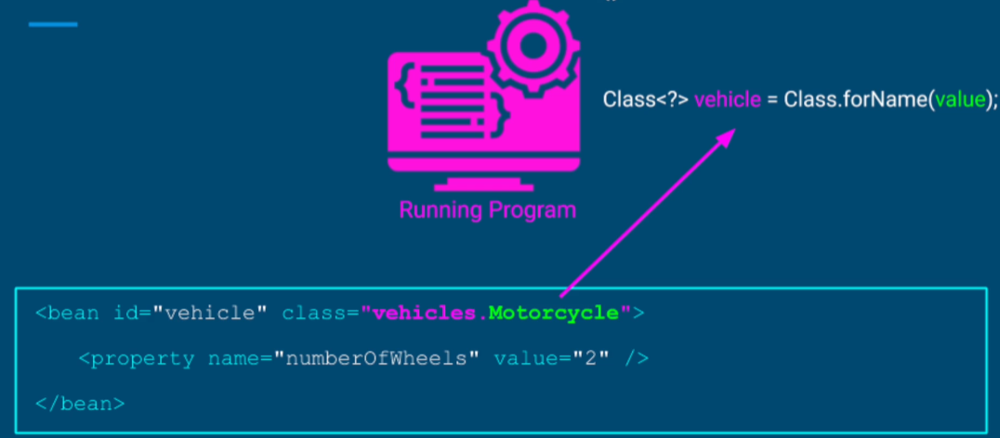
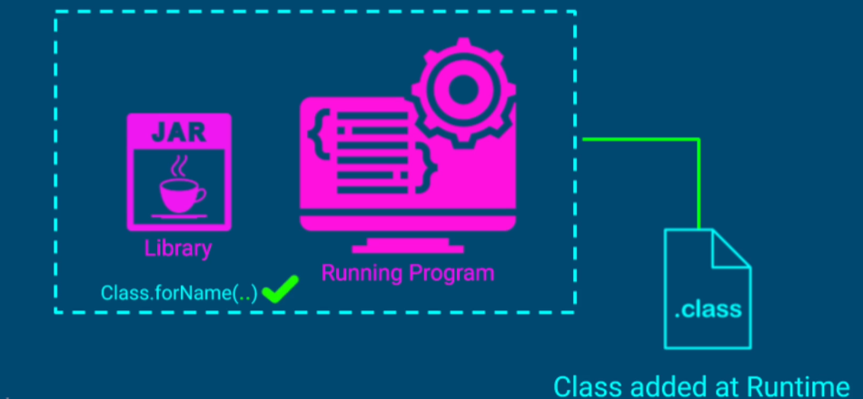
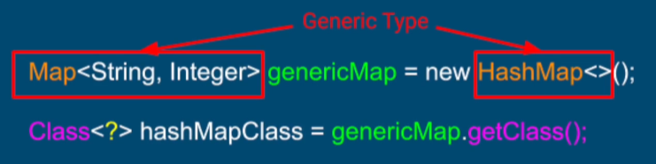
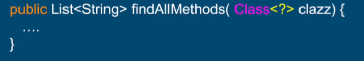
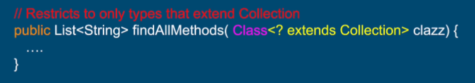

# Reflection 진입점 
- 자바 어플리케이션에서 Class<?> 형식의 코드는 리플렉션이 시작되는 진입점이라 볼 수 있음
- Class 타입 객체에는 객체 런타임 정보, 어플리케이션에 있는 특정 클래스가 존재함
- 어떤 메소드와 필드를 포함하고 있는 지, 어떤 클래스를 확장하는 지, 어떤 인터페이스를 실행하는지 알 수 있음
- 이 외에도 여러 많은 정보가 포함됨


# Class 객체 얻는 방법 3가지

1) 객체 인스턴스의 getClass 메소드를 사용 (ex : Object.getClass()) <br><br>
   
ex)  <br>
```Java
String stringObject = "some-string"; <br>
Car car = new Car(); <br>
Map<String, Integer> map = new HashMap<>(); <br><br>

Class<String> stringClass = stringObject.getClass();
Class<Car> carClass = car.getClass();
Class<?> mapClass = map.getClass();

```
- 위처럼 Class 객체의 getClass 메소드를 호출하여 런타임 타입을 얻을 수 있음 <br><br>


※ primitive(원시)타입은 Object 클래스를 상속하지 않으므로 당연히 getClass 호출 불가
```Java
boolean condition = true;

int value = 55;

double price = 1.5;

Class booleanClass = condition.getClass():      // 컴파일 에러
Class intClass = value.getClass():              // 컴파일 에러
Class doubleClass = price.getClass():           // 컴파일 에러
```
<br><br>


2) 타입 이름에 .class를 추가

- 클래스의 인스턴스가 없을 때 사용함.

ex) <br>
```Java
Class booleanType = boolean.class;
Class intType = int.class;
Class doubleType = double.class;

class MyClass {
    private int value;
    
    public boolean isNegative(float x) {...}
}
```
- .class 메소드를 사용해서 위처럼 MyClass 내 필드의 원시 타입 정보를 얻을 수 있음 <br>
  물론, 원시 타입이 아닌 Java 클래스에도 .class 호출 가능

<br><br><br>


3) 정적 메소드 Class.forName 사용 <br>

- 이 메소드를 사용하여 클래스 경로에서 동적으로 클래스를 찾을 수 있음 <br>
  인자값으로 패키지명을 포함한 이름을 넘겨줌.

ex) <br>
```Java
Class<?> stringType = Class.forName("java.lang.String");
Class<?> carType = Class.forName("vehicles.Car");

// 내부 클래스의 정보에 접근 시, 부모클래스(Car)와 내부 클래스(Engine) 사이에 달러 기호('$') 사용
Class<?> engineType = Class.forName("vehicles.Car$Engine");     

package vehicles;
class Car {
    ...
    static class Engine {...}
}
```

- 클래스 이름을 잘못 입력하면 런타임 오류와 ClassNotFoundException 예외가 터짐. <br>
- 위의 3가지 방법 중, 예외까지 고려해야 하므로 Class객체를 얻는 방법 중에서 <br>
  3번 방법이 가장 위험하다고 볼 수 있음. <br><br>
- 그럼에도 불구하고, 3번 방법을 사용해야 하는 경우가 존재함 <br><br>
  
  1) 인스턴스를 확인 or 생성하려는 타입이 사용자 정의(config) 파일에서 전달될 때 <br>
 
     - 위처럼 forName 메소드를 사용하여 개발자는 외부 텍스트 파일만을 수정함으로써 <br>
       패키지명을 포함한 이름을 config 파일에서 읽어와 의도한 대로 어플리케이션 동작을 변경할 수 있음. <br>
       즉, 소스코드를 변경할 필요 X     --> 재 컴파일 필요 X <br><br><br>

  2) 확인하려는 클래스가 프로젝트 내에 없고 코드 컴파일 시, 클래스가 존재하지 않을 경우 <br>

     - 실행 시, 해당 클래스가 어플리케이션의 클래스 경로에 추가됨.
     - 실행중인 어플리케이션과 분리된 상태의 독립적인 라이브러리를 구축하고 <br>
       어플리케이션 런타임에서 필요 시, 클래스를 load 하는 방식을 적용하고 싶을 경우에 편리함. <br><br><br>


# 자바 와일드카드와 리플렉션 활용
- 컴파일 타임에 컴파일러가 제네릭 타입을 정확하게 알 수 없을 때, 와일드카드를 사용하면 편리한데 <br>
  클래스 객체 정보를 얻을 때에도 와일드카드 방식이 유용하게 사용됨. <br><br>

  ex) <br>
  1) 문자열인 carClass 객체를 얻기 위해 forName 메소드를 사용하는 경우
   <br><br><br>
  2) 클래스의 제네릭 파라미터가 제네릭 타입이라면 와일드카드 사용 시, 편리 <br>
   <br><br><br>
  3) 와일드카드를 사용하여 클래스가 메소드로 전달되는 것을 제한할 때 유용 (매개변수가 특정한 클래스와 인터페이스만 실행하도록 제한) <br>
   <br>
  위 코드를 아래처럼 변경함으로써 제한 <br>
   <br><br><br>
  


  

